# Схема алгоритмов конвертации

Диаграмма ниже построена по фактическому коду из `src/core/convert.py`, `src/converters/registry.py`, `src/converters/base/` и специализированных конвертеров в `src/converters/*`.

GUI намеренно не отражен. Схема показывает, как `Core` подготавливает запуск, как выбирается класс конвертера, и какие реальные алгоритмы выполняются внутри `ConfigurationConverter`, `DataProcessorConverter`, `ExtensionConverter` и `ValidationConverter`.

```mermaid
---
id: 6e16cdbe-9b4b-415d-8a31-607eb411d0b4
---
stateDiagram-v2
    [*] --> Core

    state "Core (src/core/convert.py)" as Core {
        [*] --> FindEnv
        FindEnv : find_env_files()
        FindEnv --> MergeEnv
        MergeEnv : load_env_file() + merge_env_files()
        MergeEnv --> OverrideDst
        OverrideDst : optional --output -> V8_DST_PATH
        OverrideDst --> ReadScript
        ReadScript : read ScriptName / V8_SRC_PATH / V8_DST_PATH
        ReadScript --> RegistryLookup
        RegistryLookup : ConverterRegistry().get_converter()
    }

    Core --> CFG : conf2cf / conf2xml / conf2edt / conf2ib / dt2ib / ib2dt
    Core --> DP : dp2epf / dp2erf / dp2xml / dp2edt
    Core --> EXT : ext2cfe / ext2xml / ext2edt / ext2ib
    Core --> VAL : edt-validate
    Core --> CoreError : merge failed / ScriptName missing / converter not found / src-dst missing

    state "ConfigurationConverter (src/converters/configuration/converter.py)" as CFG {
        [*] --> CFG_VALIDATE
        CFG_VALIDATE : BaseConverter.validate()\n+ _validate_specific()
        CFG_VALIDATE --> CFG_TEMP
        CFG_TEMP : BaseConverter.convert()\ncreate_temp_dir()
        CFG_TEMP --> CFG_SOURCE
        CFG_SOURCE : detect_source_type()

        CFG_SOURCE --> CFG_EDT : EDT
        CFG_SOURCE --> CFG_XML : XML
        CFG_SOURCE --> CFG_IB : FILE_IB / SERVER_IB
        CFG_SOURCE --> CFG_CF : CF
        CFG_SOURCE --> CFG_DT : DT
        CFG_SOURCE --> CFG_FAIL : unsupported source

        state "Source = EDT" as CFG_EDT {
            [*] --> CFG_EDT_BRANCH
            CFG_EDT_BRANCH --> CFG_EDT_XML : ScriptName=conf2xml
            CFG_EDT_BRANCH --> CFG_EDT_IB : ScriptName=conf2ib
            CFG_EDT_BRANCH --> CFG_EDT_CF : ScriptName=conf2cf\nor current fallback branch

            CFG_EDT_XML : edt_tool.export_to_xml()\nEDT -> XML
            CFG_EDT_IB : edt_tool.export_to_xml()\nEDT -> temp XML -> target IB\nvia designer or ibcmd
            CFG_EDT_CF : edt_tool.export_to_xml()\nEDT -> temp XML -> temp IB -> CF\nvia designer or ibcmd
        }

        state "Source = XML" as CFG_XML {
            [*] --> CFG_XML_BRANCH
            CFG_XML_BRANCH --> CFG_XML_COPY : ScriptName=conf2xml
            CFG_XML_BRANCH --> CFG_XML_IB : ScriptName=conf2ib
            CFG_XML_BRANCH --> CFG_XML_CF : ScriptName=conf2cf\nor current fallback branch

            CFG_XML_COPY : XML -> XML\ncopy tree to destination
            CFG_XML_IB : XML -> target IB\nvia designer or ibcmd
            CFG_XML_CF : XML -> temp IB -> CF\nvia designer or ibcmd
        }

        state "Source = IB" as CFG_IB {
            [*] --> CFG_IB_BRANCH
            CFG_IB_BRANCH --> CFG_IB_XML : ScriptName=conf2xml
            CFG_IB_BRANCH --> CFG_IB_EDT : ScriptName=conf2edt
            CFG_IB_BRANCH --> CFG_IB_SAME : ScriptName=conf2ib and src==dst
            CFG_IB_BRANCH --> CFG_IB_ERR : ScriptName=conf2ib and src!=dst
            CFG_IB_BRANCH --> CFG_IB_CF : ScriptName=conf2cf
            CFG_IB_BRANCH --> CFG_IB_DT : ScriptName=ib2dt

            CFG_IB_XML : IB -> XML\nvia designer or ibcmd
            CFG_IB_EDT : IB -> temp XML -> EDT\nvia designer or ibcmd + edt_tool
            CFG_IB_SAME : no-op\nreturn 0
            CFG_IB_ERR : ValidationError\nIB -> another IB not supported
            CFG_IB_CF : IB -> CF\nvia designer or ibcmd
            CFG_IB_DT : IB -> DT\nvia designer or ibcmd
        }

        state "Source = DT" as CFG_DT {
            [*] --> CFG_DT_IB
            CFG_DT_IB : ScriptName=dt2ib\nDT -> target IB\nvia designer or ibcmd
        }

        state "Source = CF" as CFG_CF {
            [*] --> CFG_CF_BRANCH
            CFG_CF_BRANCH --> CFG_CF_XML : ScriptName=conf2xml
            CFG_CF_BRANCH --> CFG_CF_EDT : ScriptName=conf2edt
            CFG_CF_BRANCH --> CFG_CF_IB : ScriptName=conf2ib
            CFG_CF_BRANCH --> CFG_CF_ERR : ScriptName=conf2cf

            CFG_CF_XML : CF -> temp IB -> XML\nvia designer or ibcmd
            CFG_CF_EDT : CF -> temp IB -> temp XML -> EDT\nvia designer or ibcmd + edt_tool
            CFG_CF_IB : CF -> target IB\nvia designer or ibcmd
            CFG_CF_ERR : ValidationError\nseparate CF -> CF branch absent
        }

        CFG_FAIL : ValidationError
    }

    state "DataProcessorConverter (src/converters/dataprocessor/converter.py)" as DP {
        [*] --> DP_VALIDATE
        DP_VALIDATE : BaseConverter.validate()\n+ dst must be directory
        DP_VALIDATE --> DP_TEMP
        DP_TEMP : BaseConverter.convert()\ncreate_temp_dir()
        DP_TEMP --> DP_SOURCE
        DP_SOURCE : detect_source_type()

        DP_SOURCE --> DP_EDT : EDT
        DP_SOURCE --> DP_XML : XML
        DP_SOURCE --> DP_FAIL : unsupported source

        state "Source = EDT" as DP_EDT {
            [*] --> DP_EDT_1
            DP_EDT_1 : edt_tool.export_to_xml()\nEDT -> temp XML
            DP_EDT_1 --> DP_EDT_2
            DP_EDT_2 : prepare_base_infobase()\nuse V8_BASE_IB or V8_BASE_CONFIG\nor create empty IB
            DP_EDT_2 --> DP_EDT_3
            DP_EDT_3 : _find_processor_files()\n+ _process_files_batch()\nXML -> EPF / ERF
        }

        state "Source = XML" as DP_XML {
            [*] --> DP_XML_1
            DP_XML_1 : prepare_base_infobase()\nuse V8_BASE_IB or V8_BASE_CONFIG\nor create empty IB
            DP_XML_1 --> DP_XML_2
            DP_XML_2 : _find_processor_files()\n+ _process_files_batch()\nXML -> EPF / ERF
        }

        DP_FAIL : ValidationError
    }

    state "ExtensionConverter (src/converters/extension/converter.py)" as EXT {
        [*] --> EXT_VALIDATE
        EXT_VALIDATE : BaseConverter.validate()\n+ _validate_specific()
        EXT_VALIDATE --> EXT_TEMP
        EXT_TEMP : BaseConverter.convert()\ncreate_temp_dir()
        EXT_TEMP --> EXT_SOURCE
        EXT_SOURCE : detect_source_type()

        EXT_SOURCE --> EXT_TARGET_IB : ScriptName=ext2ib\nsource EDT / XML / CFE
        EXT_SOURCE --> EXT_EDT : EDT
        EXT_SOURCE --> EXT_XML : XML
        EXT_SOURCE --> EXT_IB : FILE_IB / SERVER_IB
        EXT_SOURCE --> EXT_CFE : CFE
        EXT_SOURCE --> EXT_FAIL : unsupported source

        EXT_TARGET_IB : EDT -> temp XML -> target IB\nor XML/CFE -> target IB\nvia designer or ibcmd

        state "Source = EDT" as EXT_EDT {
            [*] --> EXT_EDT_1
            EXT_EDT_1 : edt_tool.export_to_xml()\nEDT -> temp XML
            EXT_EDT_1 --> EXT_EDT_2
            EXT_EDT_2 : prepare_base_infobase()
            EXT_EDT_2 --> EXT_EDT_3
            EXT_EDT_3 : v8_tool.load_config_from_files(..., extension_name)
            EXT_EDT_3 --> EXT_EDT_4
            EXT_EDT_4 : v8_tool.dump_config(..., extension_name)\nIB -> CFE
        }

        state "Source = XML" as EXT_XML {
            [*] --> EXT_XML_1
            EXT_XML_1 : prepare_base_infobase()
            EXT_XML_1 --> EXT_XML_2
            EXT_XML_2 : v8_tool.load_config_from_files(..., extension_name)\nXML -> IB
            EXT_XML_2 --> EXT_XML_3
            EXT_XML_3 : dump extension from IB\nvia designer or ibcmd -> CFE
        }

        state "Source = IB" as EXT_IB {
            [*] --> EXT_IB_1
            EXT_IB_1 : dump extension from source IB\nvia designer or ibcmd -> CFE
        }

        state "Source = CFE" as EXT_CFE {
            [*] --> EXT_CFE_BRANCH
            EXT_CFE_BRANCH --> EXT_CFE_XML : ScriptName=ext2xml
            EXT_CFE_BRANCH --> EXT_CFE_EDT : ScriptName=ext2edt
            EXT_CFE_BRANCH --> EXT_CFE_ERR : other ScriptName

            EXT_CFE_XML : prepare_base_infobase()\nLoad CFE into IB -> XML
            EXT_CFE_EDT : prepare_base_infobase()\nLoad CFE into IB -> temp XML -> EDT
            EXT_CFE_ERR : ValidationError / unsupported branch
        }

        EXT_FAIL : ValidationError
    }

    state "ValidationConverter (src/converters/validation/converter.py)" as VAL {
        [*] --> VAL_VALIDATE
        VAL_VALIDATE : custom validate()\nsource must be EDT
        VAL_VALIDATE --> VAL_TEMP
        VAL_TEMP : BaseConverter.convert()\ncreate_temp_dir()
        VAL_TEMP --> VAL_REPORT
        VAL_REPORT : resolve report path\nfile or directory/report.txt
        VAL_REPORT --> VAL_STRUCTURE
        VAL_STRUCTURE : _validate_edt_structure()\nDT-INF + .project + src + metadata
        VAL_STRUCTURE --> VAL_TOOL
        VAL_TOOL : find EDT tool\nEDTCLI_TOOL -> auto-search 1cedtcli\n-> RING_TOOL -> where ring
        VAL_TOOL --> VAL_RUN
        VAL_RUN : run validate command\n(edtcli or ring)
        VAL_RUN --> VAL_PARSE
        VAL_PARSE : parse TSV report\ncount severities + list critical issues
    }

    CFG --> CoreSuccess : exit_code=0
    DP --> CoreSuccess : exit_code=0
    EXT --> CoreSuccess : exit_code=0
    VAL --> CoreSuccess : exit_code=0

    CFG --> CoreError : exit_code=1
    DP --> CoreError : exit_code=1
    EXT --> CoreError : exit_code=1
    VAL --> CoreError : exit_code=1

    state "Core success finalization" as CoreSuccess
    CoreSuccess : log success\ncheck dst exists\nreturn 0

    state "Core error finalization" as CoreError
    CoreError : log error / traceback\nkeep temp on failure\nreturn 1

    CoreSuccess --> [*]
    CoreError --> [*]
```

## Примечания и ограничения

- Схема отражает текущее рабочее состояние `src/`, а не только ожидаемую архитектуру по названиям `ScriptName`.
- Для `ConfigurationConverter` реально реализованы рабочие маршруты:
  - `EDT -> XML`, `EDT -> IB`, `EDT -> CF`
  - `XML -> XML`, `XML -> IB`, `XML -> CF`
  - `IB -> XML`, `IB -> EDT`, `IB -> CF`
  - `CF -> XML`, `CF -> EDT`, `CF -> IB`
  - `DT -> IB`, `IB -> DT`
- Для `ConfigurationConverter` есть важные расхождения:
  - при источнике `EDT` или `XML` и `ScriptName=conf2edt` отдельной EDT-ветки нет; код попадает в fallback-путь, который ведет в `CF`;
  - `IB -> IB` поддержан только как no-op, если источник и назначение совпадают;
  - отдельного маршрута `CF -> CF` нет.
- Для `DataProcessorConverter` текущая реализация по факту работает как `EDT/XML -> EPF/ERF`.
- Для `DataProcessorConverter` зарегистрированы `dp2xml` и `dp2edt`, но отдельные алгоритмы для них в Python-коде сейчас не реализованы.
- Для `DataProcessorConverter` `dp2epf` и `dp2erf` не разделяют разные state-маршруты: итоговое расширение определяется найденным XML-объектом (`ExternalDataProcessors` -> `.epf`, `ExternalReports` -> `.erf`).
- Для `ExtensionConverter` текущие рабочие маршруты по факту:
  - `EDT -> CFE`
  - `XML -> CFE`
  - `IB -> CFE`
  - `CFE -> XML`
  - `CFE -> EDT`
  - `EDT/XML/CFE -> IB`
- Для `ExtensionConverter` есть расхождения:
  - ветки `EDT/XML/IB` для сценариев, кроме `ext2ib`, приходят к экспорту в `CFE`;
  - `ext2ib` принимает `EDT`, `XML` и `CFE`, но не загружает расширение из другой ИБ.
- Для `ValidationConverter` вход должен быть уже EDT-проектом. Автоматического предварительного преобразования из `CF/XML/CFE/IB` внутри Python-валидатора нет.

## Какие файлы являются источником истины для схемы

- `src/core/convert.py`
- `src/converters/registry.py`
- `src/converters/base/converter.py`
- `src/converters/base/tools.py`
- `src/converters/configuration/converter.py`
- `src/converters/dataprocessor/converter.py`
- `src/converters/extension/converter.py`
- `src/converters/validation/converter.py`
