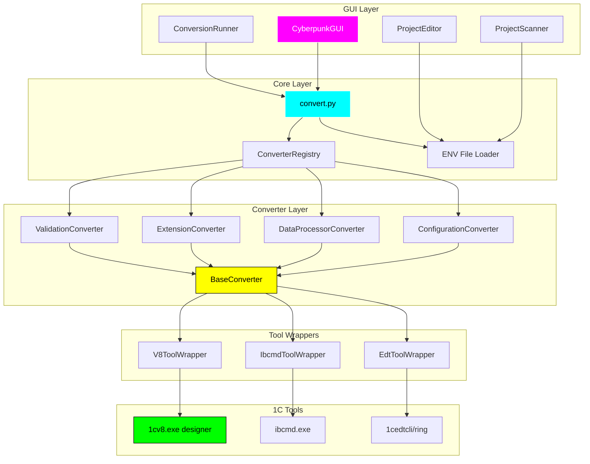

<div align="center">

# 1C-Convert-Kit


> Универсальный инструмент для конвертации файлов 1С:Предприятие между различными форматами

[]()
[]()
[]()

[Возможности](#-возможности) • [Установка](#-установка) • [Быстрый старт](#-быстрый-старт) • [Архитектура](#-архитектура)

</div>

---

## 🚀 Возможности

- 🎨 Современный GUI в стиле Cyberpunk
- 📦 Поддержка множества форматов: CF, CFE, EPF, ERF, XML, EDT
- 🔄 Пакетная конвертация проектов
- ➕ Управление проектами: добавление, изменение, копирование, удаление
- 📊 Детальная информация о параметрах проектов
- 📝 Логирование в реальном времени
- ⚙️ Гибкая настройка через .env файлы

## 🛠️ Установка

```bash
# Клонировать репозиторий
git clone https://github.com/username/1c-convert-kit.git
cd 1c-convert-kit

# Установить зависимости
pip install -r requirements.txt

# Запустить GUI
python src/gui/main.py
# или
run_gui.cmd  # для Windows
./run_gui.sh # для Linux/Mac
```

## 📖 Быстрый старт

### Вариант 1: Создание проекта через GUI (рекомендуется)

1. **Запустите GUI**
   ```bash
   run_gui.cmd  # для Windows
   # или
   run_gui.sh  # для Linux
   # или
   python src/gui/main.py
   ```

2. **Настройте базовую конфигурацию (опционально)**
   - Скопируйте `src/config/base.env.template` в `projects/base.env`
   - Укажите общие параметры (версия 1С, пути к инструментам)

3. **Создайте проект через GUI**
   - Нажмите кнопку **Добавить**
   - Заполните обязательные поля:
     - Наименование проекта
     - Тип скрипта (conf2cf, dp2epf, ext2cfe и т.д.)
     - V8_SRC_PATH - путь к источнику
     - V8_DST_PATH - путь назначения
   - Включите дополнительные параметры при необходимости
   - Нажмите **Сохранить**

4. **Запустите конвертацию**
   - Выберите проекты в таблице (клик по строке)
   - Нажмите "ВЫПОЛНИТЬ (F5)"
   - Следите за прогрессом в логе

### Вариант 2: Создание проекта вручную

1. **Настройте базовую конфигурацию**
   - Скопируйте `src/config/base.env.template` в `projects/base.env`
   - Укажите пути к 1С:Предприятие и EDT в файле настроек env

2. **Создайте проект**
   - Создайте папку в `projects/`
   - Добавьте .env файл с настройками проекта
   - Укажите `ScriptName` (например: `conf2cf`)

3. **Запустите GUI**
   - Выберите проекты для конвертации
   - Нажмите "ВЫПОЛНИТЬ"
   - Следите за прогрессом в логе

## 🏛️ Архитектура

### Схема работы системы



### Ключевые компоненты

**GUI Layer** - Графический интерфейс в стиле Cyberpunk
- Управление проектами конвертации (добавление, редактирование, копирование, удаление, изменение порядка выполнения)
- Запуск пакетной конвертации выбранных проектов
- Отображение логов в реальном времени, с замером времени выполнения каждого этапа. Плюс отображение команд выполнения (в режиме Отладка)

**Core Layer** - Ядро системы
- Загрузка и объединение .env файлов
- Автоматический выбор конвертера через Registry
- CLI интерфейс

**Converter Layer** - Модульная система конвертеров
- Единая базовая логика (BaseConverter)
- Специализированные конвертеры для каждого типа
- Автоматическое обнаружение и регистрация

**Tool Wrappers** - Абстракции над инструментами 1С
- Унифицированный интерфейс
- Обработка ошибок
- Парсинг вывода

### Преимущества архитектуры

- ✅ Автоматическое обнаружение конвертеров
- ✅ Простота добавления новых типов конвертации
- ✅ Единообразная обработка ошибок
- ✅ Расширяемость

## 🏗️ Структура проекта

```
1c-convert-kit/
├── src/
│   ├── gui/                    # GUI модули (FreeSimpleGUI)
│   │   ├── main.py            # Точка входа
│   │   ├── main_window.py     # Главное окно
│   │   ├── project_scanner.py # Сканирование проектов
│   │   ├── project_editor.py  # Редактор проектов
│   │   └── sg_import.py       # Централизованный импорт GUI
│   ├── converters/            # Модульная система конвертеров
│   │   ├── base/              # Базовые классы
│   │   │   ├── converter.py  # BaseConverter
│   │   │   └── tools.py      # Tool Wrappers
│   │   ├── registry.py        # ConverterRegistry
│   │   ├── configuration/     # Конвертер конфигураций
│   │   ├── dataprocessor/     # Конвертер обработок/отчетов
│   │   ├── extension/         # Конвертер расширений
│   │   └── validation/        # Валидатор EDT
│   ├── core/                  # Ядро системы
│   │   └── convert.py         # CLI + загрузка .env
│   ├── config/                # Конфигурация
│   │   ├── base.env.template
│   │   └── params_descriptions.json
│   └── utils/                 # Утилиты
│       └── time_utils.py      # Форматирование времени
├── projects/                  # Рабочие проекты (.env файлы)
├── tests/                     # Тесты (111 unit-тестов)
├── docs/                      # Документация
└── logs/                      # Логи выполнения
```

## 🔧 Поддерживаемые конвертации

### Конфигурации
- `conf2cf` - Конфигурация → CF файл
- `conf2xml` - Конфигурация → XML
- `conf2edt` - Конфигурация → EDT проект
- `conf2ib` - Конфигурация → Информационная база

### Обработки и отчеты
- `dp2epf` - Обработка/Отчет → EPF/ERF файл
- `dp2xml` - Обработка/Отчет → XML
- `dp2edt` - Обработка/Отчет → EDT проект

### Расширения
- `ext2cfe` - Расширение → CFE файл
- `ext2xml` - Расширение → XML
- `ext2edt` - Расширение → EDT проект
- `ext2ib` - Расширение → Информационная база

### 📋 Валидация EDT проектов
- `edt-validate` - Валидация EDT проекта

## 📚 Документация

- [Быстрый старт](QUICKSTART.md) - Начало работы за 5 минут
- [Управление проектами через GUI](docs/PROJECT_MANAGEMENT.md)
- [Валидация EDT проектов](docs/VALIDATION_GUIDE.md) - Подробное руководство
- [Архитектура системы](docs/SRC_CODE_DUPLICATION_AUDIT.md)

## 🤝 Вклад в проект

Приветствуются pull requests! Для крупных изменений сначала откройте issue для обсуждения.

## 📄 Лицензия

MIT License - см. [LICENSE](LICENSE)

## 🙏 Благодарности

Проект основан на [1CFilesConverter](https://github.com/1CFilesConverter)
